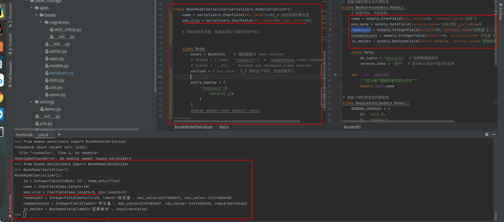

# rest_framework_demo

django-演示教学

## １、序列化与反序列化




修改添加模型类序列字段与属性

## ２、rest视图

##### rest 的APIView继承了Django的View类新增权限、认证、限流等功能

​	限流：是指限制用户访问次数来防止爬虫程序来爬去网页信息等

##### GenericAPIview与API一样是rest的视图类，他是继承了rest的ＡＰＩVeiw类新增了分页，过滤排序、指定查询集。	

​	queryset＝查询集

##### 可以指定序列化器到属性中去。

​	　serialzier_class＝序列化器

## ３、拓展类　

##### 　一共有五个拓展类，需要配合ＧenericＡＰＩＶiew使用

​	ListModelMixin	获取多少个数据对象　　

​	CreateModelMixin	保存数据　

​	RetrieveModelMxin	获取单一数据对象　	　　　　

​	UpdateModelMixin	更新数据　

​	DestroyModelMixin 	删除数据　

## 4、视图集（可以自定义视图路由）

##### 有两个基本视图集

###### 	ViewSet

​		继承自APIView

​			

###### 	GenericViewSet

​		继承自GenericView

##### 有两个拓展视图集

###### 	ModelViewSet 

​		继承GenericApiView

​			

​		继承了五个拓展类

###### 	ReadOnlyModeViewSet

​		继承GeneriApiView

​		继承LIstmodelMixin

​		继承RetrieveModelMxin	

## 5、自动生成路由（必需要是继承视图的视图类，才可以使用）

##### 	action装饰器（自定义的函数的路由的自动生成）


```python
	SimpleRouter
	DefaultRouter
```

​		

## 6、rest_认证和权限分配。

​	全局配置

​		setting中

​			

```python
REST_FRAMEWORK = {
    'DEFAULT_AUTHENTICATION_CLASSES': (
        'rest_framework.authentication.BasicAuthentication',   # 基本认证
        'rest_framework.authentication.SessionAuthentication',  # session认证
    ),
    'DEFAULT_PERMISSION_CLASSES': (
        'rest_framework.permissions.IsAuthenticated',
    )
}
```

​	局部配置

​		视图中

```python
from rest_framework.authentication import BasicAuthentication, SessionAuthentication
from rest_framework.permissions import IsAuthenticated
    authentication_classes = (BasicAuthentication, SessionAuthentication)
    permission_classes = (IsAuthenticated, )
```